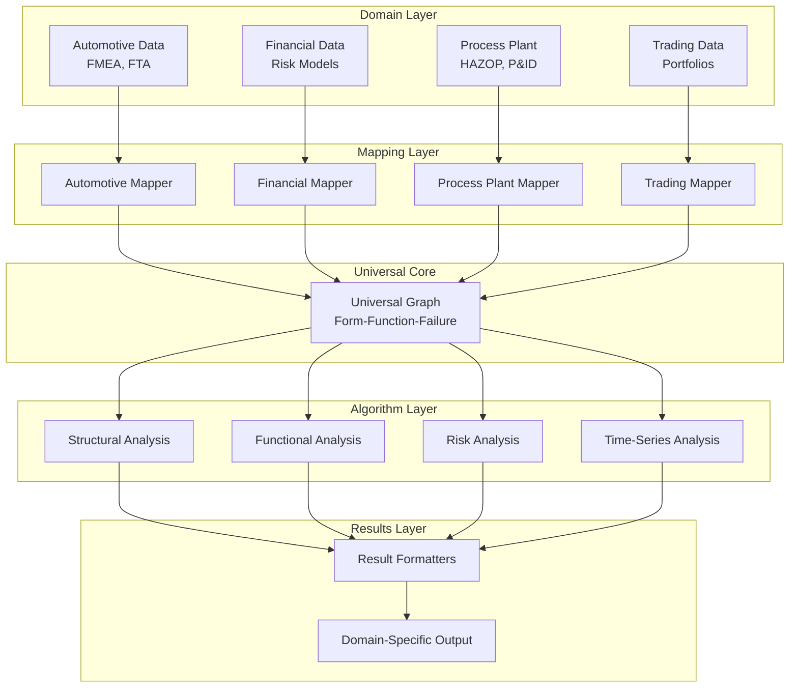
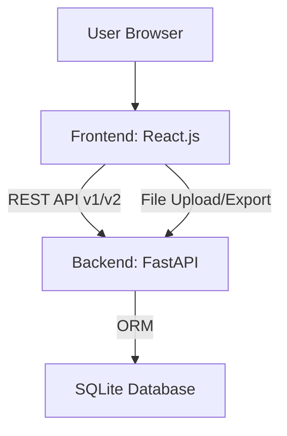

# SafetyMindPro Architecture

## Overview

SafetyMindPro is a universal graph-based analysis platform that supports multiple domains (automotive, financial, process plant, trading) through a unified **Form-Function-Failure** architecture.

### Architecture Evolution

**Version 1.0 (Legacy):**
```
Domain → Custom Graph → Domain-Specific Algorithms → Results
```

**Version 2.0 (Current - Universal):**
```
Domain → Mapper → Universal Graph → Universal Algorithms → Formatter → Results
```

## Core Architecture Principles

### Form-Function-Failure Paradigm

The system models any domain problem as a graph with three layers:

1. **Form Layer** - Physical/logical structure (WHAT exists)
   - Nodes representing components, equipment, accounts, portfolios
   - Static characteristics (type, material, capacity, etc.)
   - Dynamic properties with time-series data (temperature, balance, etc.)

2. **Function Layer** - Behavioral structure (WHAT it does)
   - Hierarchical function decomposition
   - Input/output specifications
   - Performance metrics
   - Function dependencies

3. **Failure Layer** - Risk structure (WHAT can go wrong)
   - Failure modes and their characteristics
   - Propagation paths
   - Severity, probability, detectability
   - Mitigation mechanisms

## System Architecture Diagram



## High-Level Architecture



## Component Details

### 1. Universal Graph Core (`backend/core/`)

**`universal_graph.py`** - Domain-independent graph structure
- `TimeSeriesData` - Time-varying properties
- `FormElement` - Universal nodes
- `Function` - Behavioral structure
- `FailureMode` - Risk structure
- `UniversalGraph` - Main graph container

**`domain_mapper.py`** - Mapper interface
- `DomainMapper` - Abstract base class for all domain mappers

### 2. Universal Algorithms (`backend/algorithms/`)

All algorithms are 100% domain-independent:

- **`structural_analysis.py`** - Form-centric analysis
  - `compute_criticality()` - Component criticality scores
  - `analyze_structure()` - Comprehensive structural metrics
  - Centrality measures, bottleneck identification

- **`functional_analysis.py`** - Function-centric analysis
  - `analyze_function_tree()` - Function hierarchy analysis
  - `identify_function_bottlenecks()` - Performance bottlenecks
  - `compute_function_redundancy()` - Redundancy analysis

- **`risk_analysis.py`** - Failure-centric analysis
  - `analyze_failure_propagation()` - Propagation paths
  - `compute_risk_priority()` - Risk priority numbers
  - Cascading failure analysis

- **`timeseries_analysis.py`** - Property-centric analysis
  - `analyze_timeseries()` - Time-series analysis
  - `detect_anomalies()` - Anomaly detection
  - `compute_trends()` - Trend analysis
  - `forecast_values()` - Future value prediction

### 3. Domain Mappers (`backend/domains/`)

Each domain implements the `DomainMapper` interface:

- **`automotive/mapper.py`** - FMEA/FTA mapping
  - Component → FormElement
  - FMEA → FailureMode
  - Automotive functions → Function

- **`financial/mapper.py`** - Financial risk mapping
  - Account → FormElement
  - Risk → FailureMode
  - Transaction → Function

- **`process_plant/mapper.py`** - HAZOP mapping
  - Equipment → FormElement
  - HAZOP deviation → FailureMode
  - Process function → Function

- **`trading/mapper.py`** - Portfolio mapping
  - Portfolio → FormElement
  - Market risk → FailureMode
  - Trading strategy → Function

### 4. API Layer (`backend/routers/`)

**V1 API** (`/api/v1/domains/`) - Legacy adapter-based
- Domain adapters
- Algorithm execution
- Backward compatible

**V2 API** (`/api/v2/domains/`) - Universal architecture
- `/mappers` - List available mappers
- `/{domain}/analyze` - Universal analysis endpoint
- `/{domain}/validate` - Validate domain data
- `/{domain}/metadata` - Get mapper metadata
- `/{domain}/convert-to-universal` - Convert to universal graph

### 5. Database Models (`backend/models.py`)

- `User` - User accounts
- `Project` - User projects
- `Graph` - Graph storage (v1)
- `UniversalGraphData` - Universal graph storage (v2)
- `AnalysisResult` - Analysis results

## Data Flow

### V2 Universal Analysis Flow

1. **Input**: Domain-specific data (JSON)
2. **Mapping**: Domain mapper converts to UniversalGraph
3. **Analysis**: Universal algorithm processes graph
4. **Formatting**: Result formatter converts back to domain format
5. **Output**: Domain-specific results

### Example: Automotive FMEA Analysis

```python
# 1. Domain data
automotive_data = {
    'components': [...],
    'failure_modes': [...],
    'functions': [...]
}

# 2. Map to universal
mapper = AutomotiveMapper()
universal_graph = mapper.map_to_universal_graph(automotive_data)

# 3. Run universal algorithm
risk_results = risk_analysis.analyze_failure_propagation(universal_graph)

# 4. Format results
formatted = mapper.format_results(risk_results, universal_graph)

# Output: Automotive-specific FMEA results
```

## Key Features

### Domain Independence
- Algorithms work on ANY domain
- Write once, use everywhere
- No domain-specific code in algorithms

### Separation of Concerns
- **Universal Core**: Graph structure and algorithms
- **Domain Mappers**: Translation between domains and universal structure
- **API Layer**: Request handling and routing

### Extensibility
- Add new domain: Implement mapper only
- Add new algorithm: Works on all domains automatically
- Add new analysis: Universal implementation

### Time-Series Support
- Dynamic properties tracked over time
- Anomaly detection
- Trend analysis
- Forecasting

## Technology Stack

- **Backend**: FastAPI (Python 3.13)
- **Graph Library**: NetworkX
- **Database**: SQLAlchemy + SQLite
- **API**: REST (v1 and v2)
- **Authentication**: JWT tokens

## Future Enhancements

- Graph visualization with D3.js
- Real-time streaming analytics
- Machine learning integration
- Multi-user collaboration
- Cloud deployment support

